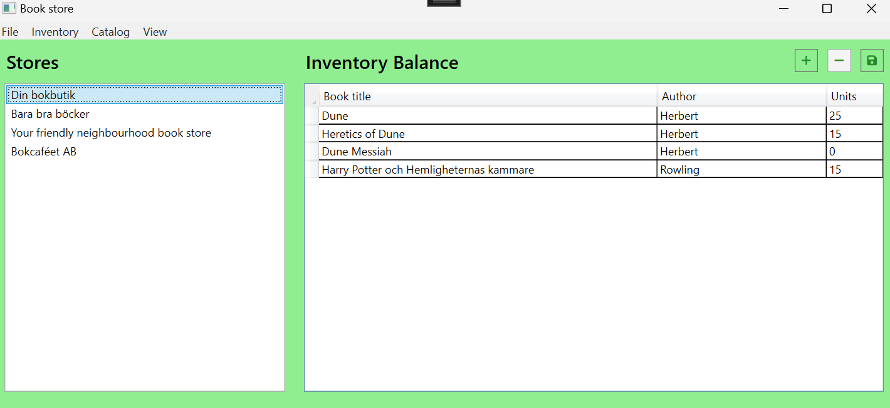
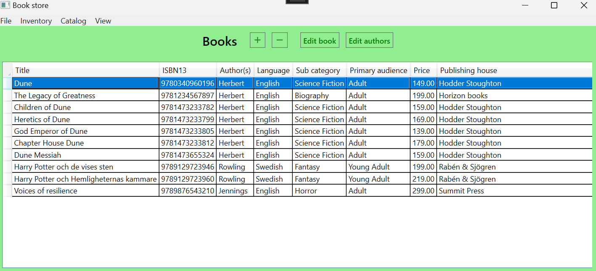
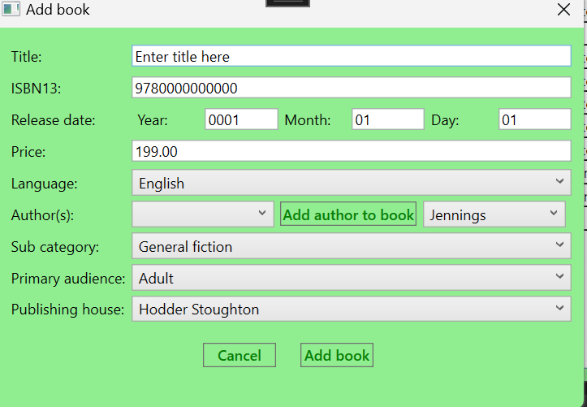
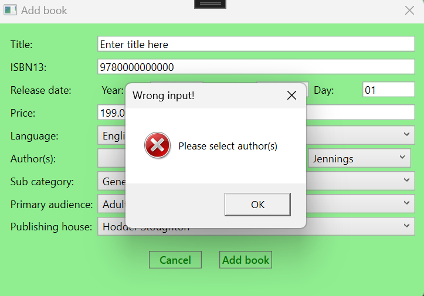

# THE Book store app

## Features
This is an app that helps a book store company keep track of and edit:

1. The inventory in their stores.
2. Their book catalog

### Inventory view

- Adding/Editing/removing inventory posts from the company's different stores.

- When adding a book to a store, you will only be able to choose from books that aren't already
in the store's inventory.

- Manual saving

### Catalog view

- Adding/Editing/Removing books and authors from the catalog.
- Automatic saving
- Dialog for adding book:

- Checking inputs (All fields):

## Tech overview:

This is a windows app made with WPF following the MVVM architectural pattern.

This app communicates with a Microsoft SQL server database, using Entity Framework Core, to 
get and store it's data. 

I've used Entity Framework Core to make a scaffolding of a book store company data base 
that I had already made as the base of this application.

## Setup

To run the app you'll need to configure up Microsoft SQL server with the database 
that can be restored from the .bak file which can be found in folder "Database_Backup".

You'll also need to set up user secrets for connection to database like:

{ 
	"DataBaseName" : "What you decided to call it"
	"ServerName" : "The server you will be using"
}

## Have a good one!

/hoarse