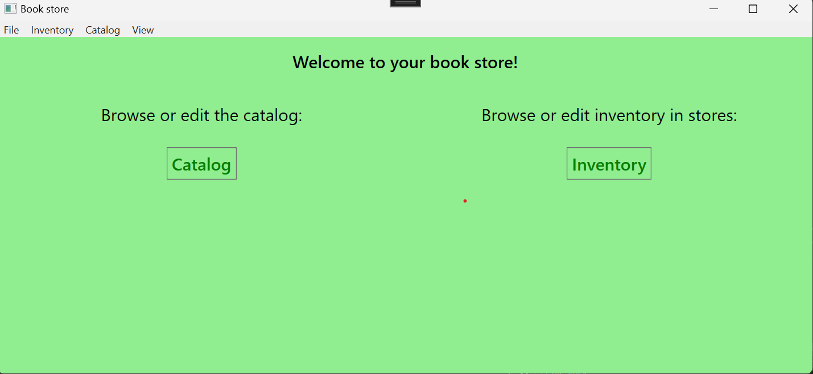

# THE Book store app

## Features
This is an app that helps a book store company keep track of and edit:

1. The inventory in their stores.
2. Their book catalog (with authors)

### Inventory view

- Adding/Editing/removing inventory posts from the company's different stores.

- When adding a book to a store, you will only be able to choose from books that aren't already
in the store's inventory.

### Catalog view

- Adding/Editing/Removing books and authors from the catalog.
- Dialog for adding book:

- Checking inputs (All fields):

## Tech overview:

This is a windows app made with WPF following the MVVM architectural pattern.

This app communicates with a SQL server database, using Entity Framework Core, to 
get and store it's data. 

I've used Entity Framework Core to make a scaffolding of a book store company data base 
that I had already made.

## Setup

Uses microsoft SQL database, database .bak file can be found in folder Database_Backup.

Uses user secret for connection to database like:

{ 
	"DataBaseName" : "What you would like to call it"
	"ServerName" : "The server you will be using"
}

## Have fun